# **KS4040 KS4041 Keyestudio Micro:bit Desk Bit Mini Car**

# 1. Description：

Keyestudio micro:bit desk bit car is designed by micro:bit V2. It consists of delicate servos, a control board with high quality and a yellow car body, which is extremely cool. You can control it via App or controller. In addition, a mountainous of comprehensive courses are provided to you. It is definitely the best choice for STEM creators and enthusiasts.

**Features：**

-   Include micro:bit V2, acrylic board and servo board.
-   Easy to build: most of components can be assembled with screws and nuts.
-   Equipped with RGB light, battery holder, sensors and modules, the control board can drive three servos at same time.
-   Multiple purpose: walking, singing, pushing stuff, drawing and playing music.
-   Support Makecode graphical programming and App control
-   21 projects included

# 2. Kit List：

| **Components**  |                                                              |         |                                                              |
| :-------------: | :----------------------------------------------------------: | :-----: | :----------------------------------------------------------: |
|     **#**      |                          **Model**                           | **QTY** |                         **Picture**                          |
|        0        | Micro:bit V2 is not included in KS4040 kit  Micro:bit V2 is included in KS4041 |    1    |  |
|        1        |                   Keyestudio Control Board                   |    1    |  |
|        2        |                          360° Servo                          |    2    |   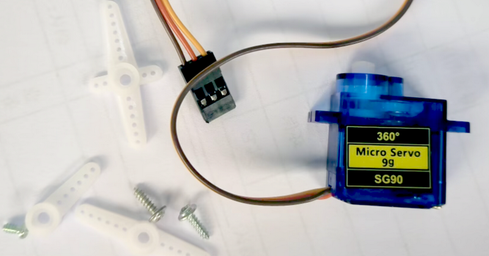   |
|        3        |                          180° Servo                          |    1    |       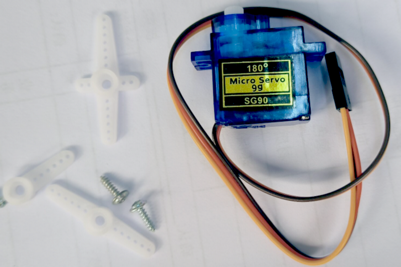        |
|        4        |                       Micro USB Cable                        |    1    |             |
|        1        |                     4 Pcs Acrylic Boards                     |    1    |         |
|        2        |                            Wheels                            |    2    |              |
|        3        |                       Universal Wheel                        |    1    |              |
| **Nuts/Screws** |                                                              |         |                                                              |
|        1        |             M3\*60MM Dual-pass Hex Copper Pillar             |    3    |  |
|        2        |             M3\*30MM Dual-pass Hex Copper Pillar             |    3    |  |
|        3        |                   M3\*30+6MM Copper Pillar                   |    1    |  |
|        4        |             M3\*35MM Dual-pass Hex Copper Pillar             |    1    |  |
|        5        |                   M3\*12+6MM Copper Pillar                   |    1    |  |
|        6        |                  M3\*16MM Round Head Screws                  |    1    |  |
|        7        |                  M2\*10MM Round Head Screws                  |    8    |  |
|        8        |                  M3\*6MM Round Head Screws                   |   12    |  |
|        9        |                  M3\*12MM Round Head Screws                  |    8    |  |
|        10        |                  M3\*12MM Flat Head Screws                  |    2    |  |
|       11        |                    M3 Nickel Plated Nuts                     |    8    |  |
|       12        |              M3 Nickel Plated Self-locking Nuts              |    2    |  |
|       13        |                    M2 Nickel  Plated Nuts                    |    8    |  |
|       14        |           M1.2\*5MM Round Head Self-tapping Screws           |    6    |  |
|    **Tools**    |                                                              |         |                                                              |
|        1        |                    WB-558 White Board Pen                    |    1    |  |
|        2        |                    3.0\*40MM Screwdriver                     |    1    | 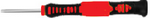 |
|        3        |                    2.0\*40MM Screwdriver                     |    1    |  |
|        4        |                         M3+M4 Wrench                         |    1    |  |
|        5        |        1.5V AA Batteries （Not included in the kit）         |    3    |  |

# 3. Preparation：

 3.1. About Micro:bit

 **What is micro:bit **

Micro:bit is designed by BBC, aiming at helping children learning programming. Micro:bit includes a 5*5 LED dot matrix, 2 programmable buttons, compass, Micro USB port, Bluetooth module, etc. It is only half the size of a credit card (4cm×5cm), but very powerful. It can be used to edit video games, sound and light interaction, robot control, scientific experiments, wearable device and so on. 

The new version, that’s the version 2.0, of Micro:bit main board has a touch-sensitive logo and a MEMS microphone. And there is a buzzer built in the other side of the board which makes playing all kinds of sound possible without any external equipment. The golden fingers and gears added provide a better fixing of crocodile clips. Moreover, this board has a sleeping mode to lower power consumption of battery and it can be entered if users long press the Reset & Power button on the back of it. More importantly, the CPU capacity of this version is much better than that of the V1.5 and the V2 has more RMA. 

In final analysis, the Micro:bit main board V2 can allow customers to explore more functions so as to make more innovative products.

 **Micro:bit Pinout：**

Micro:bit V2：

Micro:bit V1.5

Micro:bit V1.5 VS Micro:bit V2

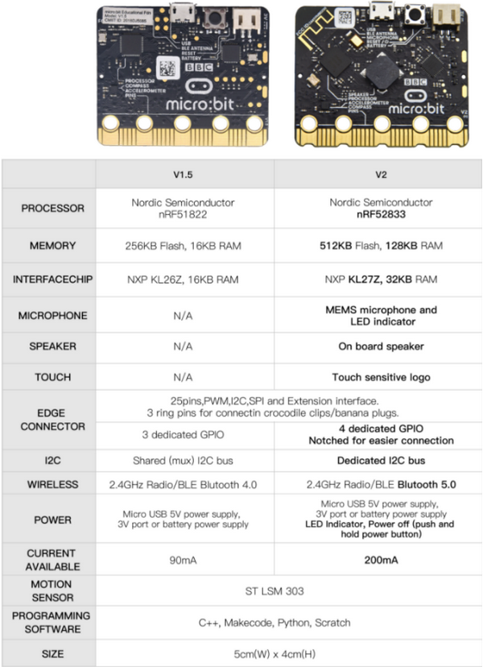

You can reboot micro:bit V2 when pressing reset and power button.

LED will get dark and the power-saving mode will be activated if you keep pressing reset and power button, which can make the life expectancy of batteries longer and activate micro:bit.

More resources：

<https://tech.microbit.org/hardware>

<https://microbit.org/new-microbit/>

<https://www.microbit.org/get-started/user-guide/overview/>

<https://microbit.org/get-started/user-guide/features-in-depth>

**Micro:bit Pinout**

V2：

 

V1.5：

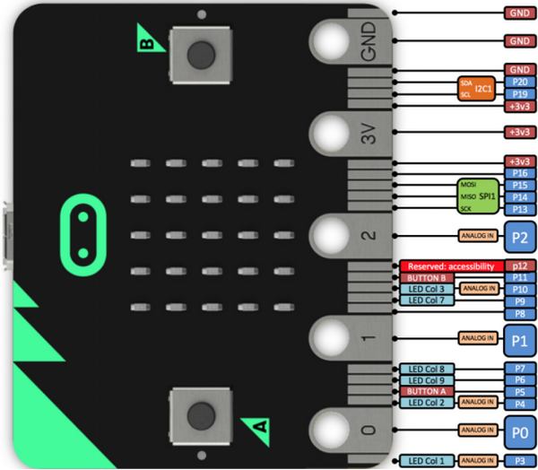  

Official website：

<https://tech.microbit.org/hardware/edgeconnector>

<https://microbit.org/guide/hardware/pins>

**Note**:

a. Put it on with silicone case to prevent the short circuit due to electronic components on micro:bit V2

b. Don’t interface it with high current components(such as servo MG995, DC motor) because of weak driving ability (less than 300mA) of IO port of micro:bit V2, otherwise, it will be burned out. We recommend you to work with micro:bit expansion board before using it.

c. We supply power via USB port or 3V port of micro:bit V2. However, the micro:bit shield is needed if you use 5V sensor because its voltage is 3V.

d. Remember to disable(you can use this block to disable the pin )the common pins of micro:bit
like P3, P4, P6, P7 and P10 in the code, otherwise, the data will be wrong.

e. The battery above 3.3V is not allowed to be used, otherwise, micro:bit V2 will get damaged.

f. Don’t put it on the metal object to avoid short circuit.

Online Makecode editor: <https://microbit.org/code>

 3.2. Install the Driver of Micro:bit

The installation of driver wouldn't be needed, if you already installed it.

But, you need to install the driver of micro:bit if it’s your first time to use micro:bit.

Download link: <https://fs.keyestudio.com/KS4013-4026>

You could download driver file () in the folder.

# 4. Programming：

We will take Windows system as an example.

## 4.1 Quick Start：

This chapter introduces how to program and download code to micro:bit V2. There are detailed tutorials in the official website, as shown below:

[https://microbit.org/guide/quick/](https://microbit.org/guide/quick/)

 Step 1: Connect Micro:bit V2

Interface micro:bit with your computer using USB cable.（Guide to mobile & tablet apps：<https://microbit.org/get-started/user-guide/mobile>).

Macs , PCs, Chromebooks and Linux system（including Raspberry Pi）support micro：bit V2.

After connecting it to computer, red LED of micro:bit V2 will be on.

There will be a MICROBIT drive in your computer, as shown below:

 Step 2: Programming：

Enter <https://makecode.microbit.org/> (we recommend you to use Google Chrome), then click  and you will view a
dialog box.

Input“heartbeat”to name your project and click“Create”

You could download Makecode app if your system is Windows 10:

[https://www.microsoft.com/zh-cn/p/makecode-for-micro-bit/9pjc7sv48lcx?ocid=badgep&rtc=1&activetab=pivot:overviewtab](https://www.microsoft.com/zh-cn/p/makecode-for-micro-bit/9pjc7sv48lcx?ocid=badgep&rtc=1#activetab=pivot:overviewtab)

Through MakeCode editor, you just need to drag blocks from block area into code editing area to program. Then run this code, as shown below:

 Step 3: Download Code：

The code can be directly downloaded to micro:bit V2 if you tap “Download” icon on makecode App.

However, follow the steps below if you program via online makecode editor.

Enter online Makecode editor, tap“Download”to get a“hex”file. Then copy it into MICROBIT drive.

Or you could find out “hex” file firstly and right-click to select “Send to”MICROBIT（E）”.

Then hex file will be copied on MICROBIT drive.

The yellow indicator will flash when transferring“hex” into micro:bit V2. And it is solid on after the file is copied.

 Step 4: Run Program：

Download code to micro:bit V2 and plug in power with USB cable.

5 x 5 LED will show heartbeat pattern.

Power via micro USB & via external power（3V）

You can edit the code in other ways:

<https://microbit.org/code/>

<https://microbit.org/projects/>

## 4.2. Makecode：

Navigate <https://makecode.microbit.org/> on Google Chrome, and enter online makecode editor. Perhaps, you can open makecode app for Windows 10.

Click , input “heartbeat” and enter Makecode editor, as shown below:

There are blocks “on start” and “forever” in the code editing area.

After powering on or resetting, “on start”means that the code in the block only executes once, while“forever”implies that the code runs cyclically.

## 4.3. Quick Download：

You can click“download”to transfer code to micro:bit V2 if you use makecode App for Windows 10.

Whereas, the online Makecode editor requires intricate steps.

Operating Google Chrome on Android, ChromeOS, Linux, macOS or Windows 10 system, you can achieve the quick download.

We use the webUSB function of Chrome to allow the internet page to access the hardware device connected USB.

You can refer to the following steps to connect and pair device.

**Device Pairing :**

Interface micro:bit V2 with computer using USB cable.

Click  beside  and tap .

Continue to tap 

Then select the device you want to connect and tap  in the window.

If there is no device in the window, please refer to the following link： [https://makecode.microbit.org/device/usb/webusb/troubleshoot](https://makecode.microbit.org/device/usb/webusb/troubleshoot)

We also provide in the resource link <https://fs.keyestudio.com/KS4013-4026>.

What’s more, if you don’t know how to update the firmware of micro:bit, refer to the link: [https://microbit.org/guide/firmware/](https://microbit.org/guide/firmware/%20) or browse folderwe provide.

After connecting successfully, press buttons and download code to micro:bit V2.

## 4.4. How to Import Extension Library

Next, we need to import Desk Bit extension library for further lessons.

Add a Desk Bit extension library

Enter Makecode editor and click icon and tap 

Copy <https://github.com/keyestudio-team/DeskBit> in the searching box to search desk bit extension library.

After the installation, extension library  will appear in the page, and download Neopixel extension library .

**Note: the extension library added is only valid to one project, therefore, it won’t appear in other projects.**

**You need to import Desk Bit extension library again when creating new projects.**

Update or Delete Desk Bit Extension Library.

Refer to the following instruction please, if you intend to update or delete Desk Bit extension library.

Click "Js JavaScript" button to switch into text code.

Click “Explorer” to get extension library.

Click“”to delete Desk Bit and Neopixel extension libraries; next to tap“”to update Desk Bit and Neopixel extension files.

## 4.5. Resources and Code

Download Link：<https://fs.keyestudio.com/KS4013-4026>

After downloading the tool package, you can open a file named KS4040 (KS4041) Keyestudio Micro：bit Desk Bit car. It can be placed everywhere in your computer. Open the file and you will find following files:

## 4.6. Import Code：

We provide every program with hex file. You can import it directly or program in Makecode blocks area, therefore, the extension library must be added.

Next, we will take“heartbeat”as example to introduce how to import code.

Open online Makecode editor or Makecode App.

Click “Import” and “Import files”.

Choose file “../Makecode Code/Project 1\_ Heart beat/Project 1\_ Heart beat.hex”, then tap 

In addition to the above method of importing code , you can also directly drag code into the Makecode compiler, as shown in the figure below:

The program is imported successfully after a few seconds.

If your computer system is Windows7/8 instead of Windows 10, the device can’t be paired in Google Chrome, as a result, the digital and analog signals can’t be read.

Here, we need CoolTerm software to read data.

For the whole projects, we will use CoolTerm software.

Let’s install it firstly.

## 4.7. Install CoolTerm：

CoolTerm program is used to read the serial communication.

Download CoolTerm program:

<https://freeware.the-meiers.org/>

1. After the download, we need to install CoolTerm win , and we take example of the Window system

2. Choose “win”

   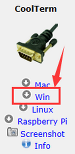

3.  Unzip file and open it. (also suitable for Mac and Linux system)

4. Double-click 

Note: Firstly, you have to install the driver of micro:bit and connect micro:bit V2 to computer.

The functions of each button on the toolbar are listed below: <http://wiki.keyestudio.com/index.php/File:IDE.png>

|                          ICON                          | FUNCTION                                         |
| :----------------------------------------------------: | ------------------------------------------------ |
|         | Opens up a new Terminal                          |
|         | Opens a saved Connection                         |
|         | Saves the current Connection to disk             |
|  | Opens the Serial Connection                      |
|  | Closes the Serial Connection                     |
|  | Clears the Received Data                         |
|  | Opens the Connection Options Dialog              |
|  | Displays the Terminal Data in Hexadecimal Format |
|         | Displays the Help Window                         |

# 5. Install Micro:bit Desk Bit Car：

 **1. Install micro:bit V2 and control board**

Note: take out the 5 pcs M3\*6MM flat screws from control board

b. Then fix micro:bit onto control board with 5 pcs M3\*6MM flat screws, as shown below;

 **2. Mount the right board**

 **3. Assemble left board**

 **4. Mount Base Plate**

 **5. Install the insertion part of control board**

 **6. Fix the boards of desk bit car**

 **7. Fix left arm**

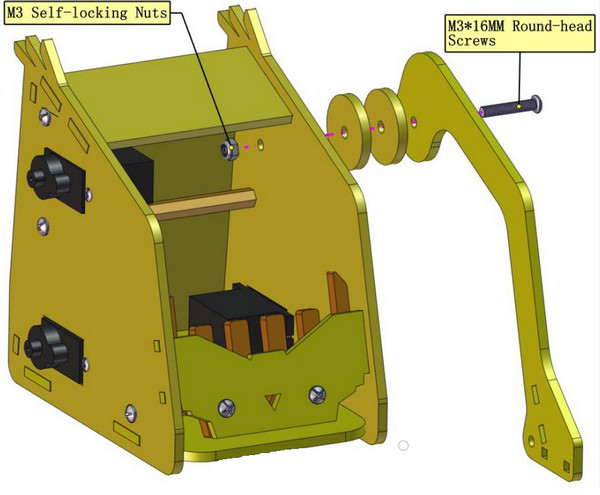

 **8. Mount Wheels**

 **9. Mount Right Arm**

Open the shared folder in the resource link: , and find out the folder “Initialize 180° servo”

Initialize 180° servo to 0°.

Dial the DIP switch to ON end to power on

Dial the DIP switch to SERVO end to control servo

Download code to micro:bit V2 and plug in power with USB cable. Rotate servo to 0°

 10. Install the fork part

Servo of arm servo of left wheel

servo of right wheel

Insert the control board with micro:bit V2 into the car

# 6. Projects：

## Project 1: Heartbeat

 **Description:**

Prepare a Micro:bit V2, a USB cable and a computer. Next we will conduct a basic experiment that a heartbeat pattern flashes on micro:bit board.

 **Components Needed:**

-   Micro:bit V2 \*1

-   Micro USB Cable\*1

 **Wiring Up:**

Interface micro:bit V2 with your computer using micro USB cable.

 **Test Results:**

You can enter this website [https://makecode.micro:bit.org/reference](https://makecode.microbit.org/reference) to get more information even you’re a starter.

Edit your code in the link: [https://makecode.micro:bit.org/](https://makecode.microbit.org/)

Download code to micro:bit V2 (refer to chapter 4.3), and keep micro USB cable connected. Then image “❤” and “” will be shown on micro:bit ceaselessly.

If download unsuccessfully, disconnect micro:bit V2 and reboot it please.

Then download code to V2 board again.

## Project 2: Light Up A Single LED

 **Description:**

In this project, we will turn on one LED of micro:bit V2.

 **Components Needed:**

-   Micro:bit V2 \*1

-   Micro USB Cable\*1

 **Wiring Up:**

Interface micro:bit V2 with your computer using micro USB cable.

 **Component Overview：**

Micro:bit V2 consists of 25 light-emitting diodes, 5 pcs in a group. They correspond to x and y axis. Then the 5\*5 matrix is formed. Moreover, every diode locates at the point of x and y axis.

Virtually, we could control an LED by setting coordinate points. For instance, set coordinate point（0，0）to turn on the LED at row 1 and column 1; light up LED at the row 1 and column 3, we could set（2，0) and so on.

 **Test Results**

Download code to micro:bit V2 and connect it to computer with USB cable, the LED at coordinate point (1,0) flashes for 1 s and the LED at (3,4）blinks for 1s, alternately.

## Project 3: 5 x 5 LED Dot Matrix

 **Description:**

Dot matrix gains popularity in our life, such as LED screen, bus station and the mini TV in the lift.

The dot matrix of Micro:bit board consists of 25 light emitting diodes. In previous lesson, we have controlled LED of Micro:bit board to form patterns, numbers and character strings by setting the coordinate points. Moreover, we could adopt another way to complete the display of patterns, numbers and character strings.

 **Components Needed:**

-   Micro:bit V2 \*1

-   Micro USB Cable\*1

 **Wiring Up:**

Interface micro:bit V2 with your computer using micro USB cable.

 **Test Code:**

 **Test Results:**

Download code to micro:bit V2, and and keep USB cable connected. Micro:bit V2 will display 1, 2, 3, 4 and 5 and separately show
 icon, “Hello!”, , , ,  and patterns.

## Project 4: Programmable Buttons

 **Description:**

The circuit is controlled by button. The circuit is connected when the button is pressed; however, the circuit is disconnected when released.

Micro:bit V2 has three buttons which are the reset button on the back and two programmable buttons(A, B) on the front.

Let’s do experiments to know how they works

 **Components Needed:**

-   Micro:bit V2 \*1

-   Micro USB Cable\*1

 **Wiring Up:**

Interface micro:bit V2 with your computer using micro USB cable.

 **Test Code 1:**

 **Test Results 1:**

Download code to micro:bit V2 and keep USB cable connected.

5×5 LED dot matrix will show “A” if button A is pressed, in case that button B is pressed, “B” will appear. So will micro:bit V2 show “AB” if you press A and B buttons simultaneously.

 **Test Code 2:**

 **Test Results 2:**

Download code to micro:bit V2 and keep USB cable connected. A row of luminous LEDs are added if button A is pressed; and when B is pressed, a row of luminous LEDs are deducted.

## Project 5: Temperature Measurement

 **1. Description:**

We will introduce how to detect ambient temperature by micro:bit V2. Its detection range is -40℃\~105℃.

 **2. Components Needed:**

-   Micro:bit V2 \*1

-   Micro USB Cable\*1

 **3. Wiring Up:**

Interface micro:bit V2 with your computer using micro USB cable.

 **4. Test Code and Results:**

Download code to micro:bit V2 and plug in power with USB cable. Then click “Show console Device” button.

Open serial interface and display the temperature value, as shown below：

If your computer system is Windows7/8 instead of Windows 10, the device can’t be paired in Google Chrome, as a result, the digital and analog signals can’t be read.

Here, we need CoolTerm software to read data.

Open CoolTerm, click Options to select SerialPort. Set COM port and 115200 baud rate (the baud rate of USB serial communication of micro:bit V2 is 115200 through the test). Click “OK” and “Connect”.

The serial monitor shows the current ambient temperature value, as shown below:

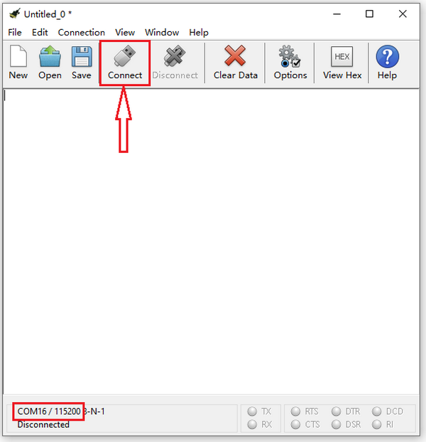

## Project 6: Geomagnetic Sensor

 **1. Description：**

This project mainly introduces the use of the Micro:bit’s compass. In addition to detecting the strength of the magnetic field, it can also be used to determine the direction, an important part of the heading and attitude reference system (AHRS) as well.
It uses LSM303AGR three-axis magnetometer whose the range of magnetic field is ±50 gauss. In this project, we will introduce how compass detect data and determine direction.

Then we can read the value detected by it to determine the location. We need to calibrate the micro:bit V2 when magnetic sensor works.  

 **2. Components Needed:**

-   Micro:bit V2 \*1

-   Micro USB Cable\*1

 **3. Wiring Up:**

Interface micro:bit V2 with your computer using micro USB cable

 **4. Test Code 1 and Results 1:**

Download code to micro:bit V2 and keep USB connected. 

As the button A is pressed, LED dot matrix indicates that“TILT TO FILL SCREEN”then enter the calibration interface. 

The calibration method: rotate the micro:bit V2 to make LED dot matrix display a full square (25 LEDs are on), as shown in the following figure:

The calibration won’t be finished until you view the smile pattern appear.

The serial monitor will show 0°, 90°, 180° and 270° when button A is pressed.

 **5. Test Code and Results 2:**

The above code means that the direction is North and the value of magnetometer is read continuously.

The micro:bit V2 shows the icon,
if the value is between 292.5 and 337.5. The value should be 293 and 338 because decimal is not allowed to be filled in the code.

**Complete Test Code 2：**

**Result 2:**

Download code to micro:bit V2 and keep USB cable connected.

After calibration (see the result1) and tilt micro:bit V2, the direction signs will be shown.

## Project 7: Accelerometer

 **Description:**

The micro:bit V2 has a built-in LSM303AGR three-axis acceleration sensor (accelerometer). Its I2C interface works on external communication, the range can be set to 1g, 2g, 4g and 8g.

We usually detect the posture of accelerometer.

In this project, we will check the value detected by accelerometer.

 **Components Needed:**

-   Micro:bit V2 \*1

-   Micro USB Cable\*1

 **Wiring Up:**

Interface micro:bit V2 with your computer using micro USB cable

 **Test Code1and Results 1:**

Download code to micro:bit V2 and keep USB cable connected.

Micro:bit V2 will display 1 if shaken.

Place micro:bit V2 vertically(logo up), then the number 2 is displayed:

Place micro:bit V2 vertically(logo down), then the number 3 is displayed:

Place micro:bit V2 horizontally (facing up), then the number 4 is displayed:

On the contrary, place micro:bit V2 horizontally (facing down), then the number 5 is displayed:

When Micro:bit board is tilt to the left, number 6 is shown.

When Micro:bit board is inclined to the right, number 7 is displayed.

When it is free fall(accidentally making it fall), number 8 will appear on dot matrix.（Note：we don’t recommend you to make it free fall, it will make board damage)

 **Test Code and Results 2：**

Download code to micro:bit V2, keep USB cable connected, and click “Show Console Device”

According to MMA8653FC manual, the acceleration coordinates of the accelerometer are shown in the following figure:

The decomposition value of acceleration on the X-axis, Y-axis, and Z-axis, and the synthesis value of acceleration (the synthesis of gravitational acceleration and other external forces) are shown below:

If your computer system is Windows7/8 instead of Windows 10, the device can’t be paired in Google Chrome, as a result, the digital and analog signals can’t be read.

Here, we need CoolTerm software to read data.

Open CoolTerm, click Options to select SerialPort.

Set COM port and 115200 baud rate(the baud rate of USB serial communication of Micro:bit is 115200 through the test).

Click “OK” and “Connect”.

CoolTerm serial monitor displays the acceleration value on x, y and z axis, as shown below:

## Project 8: Detect Light Intensity by Micro:bit

 **1. Description:**

This project will introduce how micro:bit V2 detects the external light intensity. Since micro:bit doesn’t come with photosensitive sensor, the detection of light intensity is completed through the LED matrix. When the light irradiates the LED matrix, the voltage change will be produced. Therefore, we could determine the light intensity by voltage change.

 **2. Components Needed:**

-   Micro:bit V2 \*1

-   Micro USB Cable\*1

 **3. Wiring Up:**

Interface micro:bit V2 with your computer using micro USB cable

 **4. Test Code and Test Results:**

Download code to micro:bit V2 and keep USB cable connected, and click “Show Console Device”

The intensity value is 0 when covering LED dot matrix. And the value varies with the light intensity. When placing micro:bit V2 under the sunlight, the stronger the light is, and the larger the intensity value is. As shown below:

Number 20 is a random light intensity value we set. Micro:bit V2 will show “moon” picture when the light intensity is less than or equivalent to 20; however, the “sun” image will appear if the value is more than 20.

If your computer system is Windows7/8 instead of Windows 10, the device can’t be paired in Google Chrome, as a result, the digital and analog signals can’t be read.

Here, we need CoolTerm software to read data.

Open “CoolTerm”, click “Options” to select “SerialPort”, and set “COM” port and 115200 baud rate(the baud rate of USB serial communication of micro:bit V2 is 115200 through the test).

Then click “OK” and “Connect”.

The light intensity value is shown below:

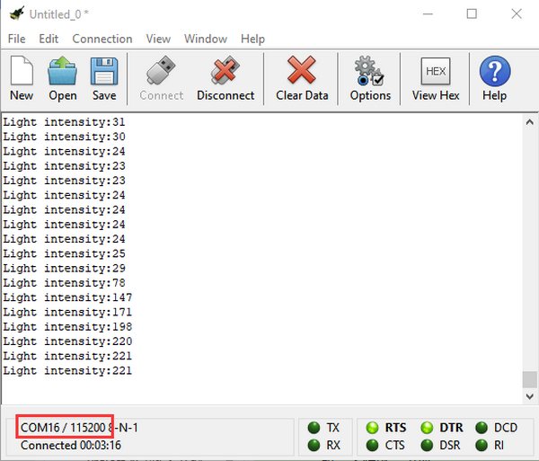

## Project 9: Speaker

 **1. Description：**

The micro:bit V2 has built-in speaker for emitting different tones. You can
composite a song like“Ode to Joy”and other beautiful songs.

 **2. Components Needed:**

-   Micro:bit V2 *1

-   Micro USB Cable*1

 **3. Wiring Up:**

Interface micro:bit V2 with your computer using micro USB cable

 **4. Test Code and Results 1:**

Download code to micro:bit V2 and plug in power with USB cable.

Then micro：bit V2 shows music icon and emits sound.

 **5. Test Code and Results 2:**

The music note is shown below:

More resource：<https://en.wikipedia.org/wiki/Numbered_musical_notation>

Download code to micro:bit V2 and plug in power with USB cable, as a result, micro:bit V2 emits song“Ode to Joy”.

## Project 10: Touch Sensitive Logo

 **Description：**

Micro:bit V2 has a touch sensitive logo as a input. It is fundamentally a capacitive touch sensor which can sense the tiny changes in the current.

 **Components Needed:**

-   Micro:bit V2 \*1

-   Micro USB Cable\*1

 **Wiring Up:**

Interface micro:bit V2 with your computer using micro USB cable

 **Test Code and Result:**

Download code to micro:bit V2 and keep USB cable connected.

Micro:bit V2 will show “❤” if you touch logo , on the contrary, the number will be shown if the log  is not touched.

## Project 11: Microphone

 **1. Description：**

The micro:bit V2 has a built-in microphone which can detect the sound intensity. Additionally, there is a microphone LED indicator at the back.

Its indicator will turn on if you clap your hands; therefore, we can make an analog noise detection watch.

 **2. Components Needed:**

-   Micro:bit V2 \*1

-   Micro USB Cable\*1

 **3. Wiring Up:**

Interface micro:bit V2 with your computer using micro USB cable.

 **4. Test Code and Results 1：**

Download code to micro:bit V2, and keep micro USB connected. Pattern “❤” will be displayed when you clap your hands; however, pattern “” will appear when in the quit environment.

 **5. Test Code and Results 2：**

Download code to micro:bit V2 and keep micro USB cable connected. Click “Show console device”.

The output sound value increases when the sound amplifies, as shown below;

Micro:bit V2 will show the maximum value of sound intensity (Note: set the maximum value via reset button), when button A is pressed; whereas, the sound level icon will be shown when clapping.

## Project 12: Bluetooth Wireless Communication

 **1. Description:**

The Micro: Bit main board V2 comes with a nRF52833 processor (with built-in Bluetooth 5.1 BLE (Bluetooth Low Energy) device) and a 2.4GHz antenna for Bluetooth wireless communication and 2.4GHz wireless communication. With the help of them, the board is able to communicate with a variety of Bluetooth devices, including smart phones and tablets.

In this project, we mainly concentrate on the Bluetooth wireless communication function of this main board. Linked with Bluetooth, it can transmit code or signals. To this end, we should connect an Apple device (a phone or an iPad) to the board. 

Since setting up Android phones to achieve wireless transmission is similar to that of Apple devices, no need to illustrate again.

 **2. Preparation**

\*Attach the Micro:bit main board V2 to your computer via the Micro USB cable.

\*An Apple device (a phone or an iPad) or an Android device;

 **3. Procedures:**

For Apple devices, enter this link <https://www.microbit.org/get-started/user-guide/ble-ios/> with your computer first, and then click  to download the Micro: Bit firmware to a folder or desk, and upload the downloaded firmware to the Micro: Bit main board V2.

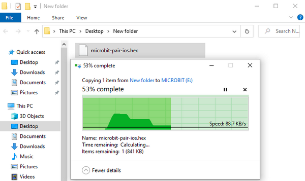

Search “micro bit”in your App Store to download the APP micro:bit.

Connect your Apple device with Micro: Bit main board V2:

Turn on the Bluetooth of your Apple device.

Open the APP micro:bit to select item  to start pairing.

Please make sure that the Micro: Bit main board V2 and your computer are still linked via the USB cable.

Secondly, click ;

Following the instructions to press button A and B at the same time(do not release them until you are told to) and press Reset & Power button for a few seconds.

Release the Reset & Power button, you will see a password pattern shows on the LED dot matrix. Now , release buttons A and B and click .

Set the password pattern on your Apple device as the same pattern showed on the matrix and click .

Still click . 

Then, a dialog box props up as shown below. Then tap . 

A few seconds later, the match is done and the LED dot matrix displays the "√" pattern. Tap .

After the match with Bluetooth, write and upload code with the App.

Click  to enter the programming page and write code.

Click  and the box  appears, and then select . 

Name the code as “1 “and click  to save it.

Click the third item  to enter the uploading page. 

The default code program for uploading is the one saved just now and named "1".

Then click the other  to upload the code program "1".

If the code is uploaded successfully a few seconds later, the App will emerge as below and the LED dot matrix of the Micro: Bit main board V2 will exhibit a heart pattern.

Projects below all conduct with the built-in sensors and the LED dot matrix while the following ones will carry out with the help of external sensors.

**（Attention：to avoid burning the the Micro:bit main board V2, please remove the USB cable and the external power from the board before fix it with a T-shaped shield; likewise, the USB cable and the external power should be cut from the main board before disconnect the shield from the board.)**

## Project 13: SK6812-P4 RGB

 **Description：**

The control board comes with five SK6812-P4 RGB lights controlled by micro:bit V2. In this lesson, we will make five SK6812-P4 RGB lights display three effects.

Note: the servo of car’s arm is interfaced with P0. You can control it via DIP switch.

Control board:

<https://wiki.keyestudio.com/KS0493_Keyestudio_Micro_bit_Shield_For_Mini_Servo_Car>

 **Preparations：**

1.  A desk bit car

2.  Place batteries into battery holder.

3.  Dial the DIP switch of mini servo car to ON end and plug in power

4.  Dial the DIP switch of mini servo car to RGB end to control RGB

5.  Interface micro:bit V2 with computer using USB cable.

6.  Enter online Makecode editor

You don’t need to add Desk Bit extension library(refer to chapter 4.6) if you choose to import Hex file.

However, you need to add desk bit extension library first if you intend to edit code in the Makecode window(refer to chapter 4.4).

 **Test Code and Results 1:**

Five pcs WS2812 RGB lights of mini servo car turn on, changing color one by one.

 **Test Code and Results 2:**

Five WS2812RGB lights turn up, like flow light.

 **Test Code and Results 3:**

5 pcs WS2812RGB of control board display random color, like flow light.

## Project 14: Servo

 **Description：**

The servo is applied widely, especially in robots. In this chapter, we will learn its working principle and how it works.

 **Preparations：**

1.  A desk bit car

2.  Place batteries into battery holder.

3.  Dial the DIP switch of mini servo car to ON end and plug in power

4.  Dial the DIP switch of mini servo car to SERVO end to control servo.

5.  Interface micro:bit V2 with computer using USB cable.

6.  Enter online Makecode editor

You don’t need to add Desk Bit extension library(refer to chapter 4.6) if you choose to import Hex file.

However, you need to add desk bit extension library first if you intend to edit code in the Makecode window (refer to chapter 4.4).

 **Components Knowledge：**

Servo motor is a position control rotary actuator. It mainly consists of housing, circuit board, core-less motor, gear and position sensor. Its working principle is that the servo receives the signal sent by MCU or receiver and produces a reference signal with a period of 20ms and width of 1.5ms, then compares the acquired DC bias voltage to the voltage of the potentiometer and obtain the voltage difference output.

In general, servo has three line in brown, red and orange. Brown wire is grounded, red one is positive pole line and orange one is signal line.

**How to control 180° and 360° servo:**

**360° servo only controls the direction and speed instead of angles like 180° servo.**

The block of desk bit extension library can determine 180° and 360° servos.

**360° Servo：**

For instance, the servo is controlled by pin P1 of micro:bit V2. The speed of servo can be set by filling number behind “to” in , as shown below:

0° indicates full speed along one direction, 180° implies full speed along the other direction. 90° represents static.

The right wheel rotates clockwise in full speed.

Download the following code to micro:bit V2.

Right wheel stay static

Download the following code to micro:bit v2

Right wheel rotates anticlockwise in full speed

0° means the full speed along one direction, 0°\~90° implies that the speed gradually reduces; however, 90° is staying static, 90°\~180° stands for the increasing speed along the opposite direction, and 180 means full speed along the opposite direction.

**180° Servo：**

**180° Servo is controlled by pin P0 of micro:bit V2.**

The speed of servo can be set by filling number in the box behind“to”, as shown below:

Download the following code to micro:bit V2.

The servo of arm rotates to 0°.

Download the following code to micro:bit.

When rotating to 90°, the arm of desk bit car is on the middle level.

The servo of arm rotates to 90°

Download the following code to micro:bit.

The servo of arm rotates to 180°

 **Test Code and Results 1:**

Servo of arm rotates from 0° to 45°, 90° to 135° and 180°.

 **Test Code and Results 2:**

The right wheel rotates for 5s, stops for 2s, rotates anticlockwise for 5s and stops 2s.

## Project 15: Desk Bit Arm

 **Description：**

In previous lesson, we can make V2 board display different patterns. In this lesson, we will control the arm of desk bit car to perform a series of actions.

 **Preparations：**

-   A desk bit car

-   Place batteries into battery holder

-   Dial the DIP switch to ON end to power on

-   Dial the DIP switch to SERVO end

-   Interface micro:bit V2 with computer using USB cable

-   Enter online Makecode editor.

You don’t need to add Desk Bit extension library(refer to chapter 4.6) if you choose to import Hex file.

However, you need to add desk bit extension library first if you intend to edit code in the Makecode window(refer to chapter 4.4).

 **Test Code and Result:**

Plug in power, touch logo of V2 board, then desk bit car will rotate its arm; however, the arm of desk bit car will return the original place if not touching logo; V2 board will show how many times you touch.

## Project 16: Desk Bit Walks

 **Description：**

This chapter introduces how to control 360° servo. We will make desk bit car go forward and backward, turn left and right and stop.

 **Preparations：**

-   A desk bit car

-   Place batteries into battery holder

-   Dial the DIP switch to ON end to power on

-   Dial the DIP switch to SERVO end.

-   Interface micro:bit V2 with computer using USB cable

-   Enter online Makecode editor.

You don’t need to add Desk Bit extension library(refer to chapter 4.6) if you choose to import Hex file.

However, you need to add desk bit extension library first if you intend to edit code in the Makecode window(refer to chapter 4.4).

 **Test Code and Results:**

Download code to micro:bit V2, dial DIP switch to ON end to power on. The car runs forward, backward, turns and right and stops.

## Project 17: Sing and Dance

 **Description：**

In this lesson, we will make desk bit car sing and dance.

 **Preparations：**

-   A desk bit car

-   Place batteries into battery holder

-   Dial the DIP switch to ON end to power on

-   Dial the DIP switch to RGB end

-   Interface micro:bit V2 with computer using USB cable

-   Enter online Makecode editor.

You don’t need to add Desk Bit extension library(refer to chapter 4.6) if you choose to import Hex file.

However, you need to add desk bit extension library first if you intend to edit code in the Makecode window(refer to chapter 4.4).

 **Test Code and Results:**

Music Note:

More resource：<https://en.wikipedia.org/wiki/Numbered_musical_notation>

Download code to micro:bit V2 and dial DIP switch to ON end. Pressing A button, you will hear a song and desk bit car will go forward and backward, rotate to left and right, with RGB displaying different colors.

## Project 18: Dodge Bullet

 **1. Description:**

In this project, we will introduce an interesting game-----Dodge Bullet。

You can play this game with button A and B.

 **2. Components Needed:**

-   Micro:bit V2 \*1

-   Micro USB Cable\*1

 **3. Wiring Up:**

Interface micro:bit V2 with your computer using micro USB cable.

 **4. Game 1：**

This game should be played on micro:bit V2. There are random LED G1 and G2 lit , and an LED G(at the bottom of micro:bit V2).

When G1 and G2 are falling down, you can move them to left and right with button A and B so as to prevent G from attacking.

If one of them attacks G, game will be over. However, game starts when pressing A and B at same time.

 **5. Test Code and Results 1:**

Download code to micro:bit V2. You can view some random LEDs falling. Then you need to press button A and B to stop them from attacking G.

 **6. Game 2：**

For game 2, we make a change in the game 1. You can be given one point if G avoids the random falling down LED, however, if it meets random LED, game will be over and the scores will appear. Press button A and B at same time to start new game.

 **7. Test Code and Results 2:**

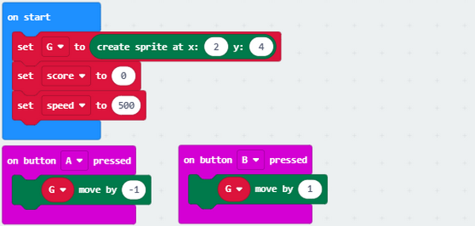

Download code to micro:bit V2. You can press button A and B to control G when the random lit LED is falling down.

You can be given one point if G dodges the random falling and lit LED. However, if it meets random LED, game will be over and the scores will appear. Press button A and B at same time to start new game.

## Project 19: Read Bluetooth Data

 **Description：**

The micro:bit V2 integrates the low consumption BLE device and pairs with phones or iPad. Thus, we can build communication between V2 board and device.

Micro:bit V2 has on-board Bluetooth for iOS and Android system.

In this project, we will introduce how to use App and its App interface.

 **Preparation：**

1.  A desk bit car

2.  Interface micro:bit V2 with computer using USB cable.

You don’t need to add Bluetooth extension library(refer to chapter 4.6) if you choose to import Hex file.

However, you need to add Bluetooth extension library first if you intend to edit code in the Makecode window. As shown below:

Bluetooth can’t work with radio at same time because of hardware, therefore, their libraries are not compatible either.

The prompt will inform of you to delete radio library, as shown below

Then “Bluetooth” extension library will be installed, as shown below

 **Test Code and Results:**

Click  and select  to set Bluetooth to “No Pairing Required” mode:

Click  to finish the setting.

Note: you can skip this step if you directly import code.

Next to download code to micro:bit V2 and plug in power with USB cable.

Now, let’s install App.

**IOS system**

a. Open App Store

b. Search desk bit and click“” to download

c. After the download, open Desk Bit app and click , as shown below.

d. Enable Bluetooth of your device, click “Connect”icon on App and choose “BCC micro:bit”among the searching results, after a while, Bluetooth is connected.

**Android System**

Navigate the website <https://play.google.com/store/apps/details?id=com.keyestudio.deskbit> to download App. Perhaps you can download Desk Bit App in the Google play store.

Note: Allow app to access your location.

Open“Desk Bit”, the interface is shown below

Enable Bluetooth of cellphone, click  and select “BCC micro:bit” among the searching results. Then click , Bluetooth is connected, as shown below；

→

The icon “Show console device” won’t be shown on Makecode editor due to the Bluetooth of micro:bit V2, therefore, the control characters sent by App can’t be read either.

Here, the CoolTerm software is needed, which is used to read the characters sent by App.

Open “CoolTerm”, click  to select “SerialPort”, and set “COM” port and 115200 baud rate(the baud rate of USB serial communication of micro:bit V2 is 115200 through the test).

Then click “OK” and “Connect”.

The light intensity value is shown below:

The function of each icon on App is shown below:

## Project 20: Control LED Dot Matrix by Bluetooth

 **Description：**

In this lesson, we will make micro:bit V2 show pictures and numbers via App.

 **Preparation：**

-   A desk bit car

-   Interface micro:bit V2 with computer using USB cable

You don’t need to add Bluetooth extension library(refer to chapter 4.6) if you choose to import Hex file.

However, you need to add Bluetooth extension library first in  if you intend to edit code in the Makecode window. As shown below:

 **Test Code and Results:**

Download code to micro:bit V2, and plug in power with USB cable.

Micro:bit V2 will show “”, then open APP and connect Bluetooth.

Next, the character “o” will be sent and pattern “” will appear. 

Tickto send character “1”, LED dot matrix will display 1；

Click to send character “2”，micro:bit V2 shows “2”；

clickto send character “3”，number “3” is shows on LED dot matrix；

clickto send character “4”, number “4” is shows on LED dot matrix；

clickto send character “5”, number “5” is shows on LED dot matrix；

clickto send character “6”, number “6” is shows on LED dot matrix；

click “disconnect” icon on App to disconnect Bluetooth, pattern“”appears on LED dot matrix.

## Project 21: Multi-purpose Desk Bit Car

 **Description：**

In previous lesson, we introduced how to use App and test each icons.

In this lesson, we will control the desk bit car via App to make it perform different functions.

 **Preparation：**

-   A desk bit car

-   Place batteries into battery holder

-   Dial the DIP switch to ON end

-   Interface micro:bit V2 with computer using USB cable

-   Enter online Makecode editor.

You don’t need to add desk bit extension library(refer to chapter 4.6) if you choose to import Hex file.

However, you need to add desk bit extension library first if you intend to edit code in the Makecode window(refer to chapter 4.4).

 **Test Code and Results:**

**Note: Remember to dial the DIP switch to RGB end if you want to control RGB by Bluetooth.**

**Dial DIP switch to SERVO end if you want to control the servo of right arm.**

The Keyestudio micro:bit desk bit car can be controlled by App.

 Drawing

Back is a circular column

Place the pen of this kit into circular column, set code and download it to micro:bit V2, then the mini car can draw on the paper. Furthermore, you can make desk bit car push light stuffs by setting code.

# 7. Resources：

[https://fs.keyestudio.com/KS4013-4026](https://fs.keyestudio.com/KS4013-4026)

[https://makecode.microbit.org](https://makecode.microbit.org)

[https://tech.microbit.org/hardware](https://tech.microbit.org/hardware)

[https://microbit.org/new-microbit](https://microbit.org/new-microbit)

[https://www.microbit.org/get-started/user-guide/overview](https://www.microbit.org/get-started/user-guide/overview)

[https://microbit.org/get-started/user-guide/features-in-depth](https://microbit.org/get-started/user-guide/features-in-depth)

[https://tech.microbit.org/hardware/edgeconnector](https://tech.microbit.org/hardware/edgeconnector)

[https://microbit.org/guide/hardware/pins](https://microbit.org/guide/hardware/pins)

[https://microbit.org/guide/quick/](https://microbit.org/guide/quick/)

[https://microbit.org/get-started/user-guide/mobile](https://microbit.org/get-started/user-guide/mobile)

[https://microbit.org/code](https://microbit.org/code)

[https://microbit.org/projects](https://microbit.org/projects)

